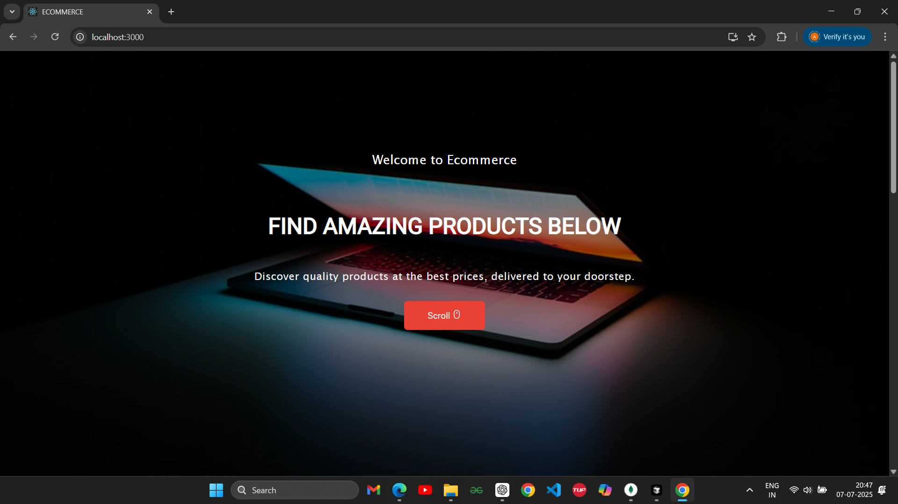
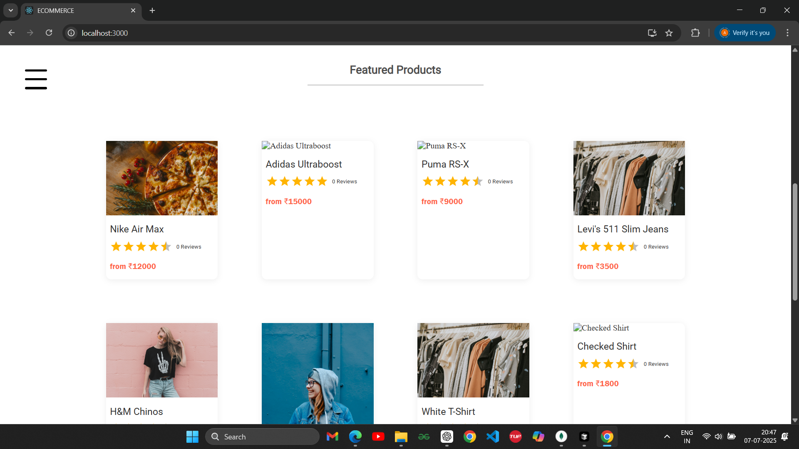
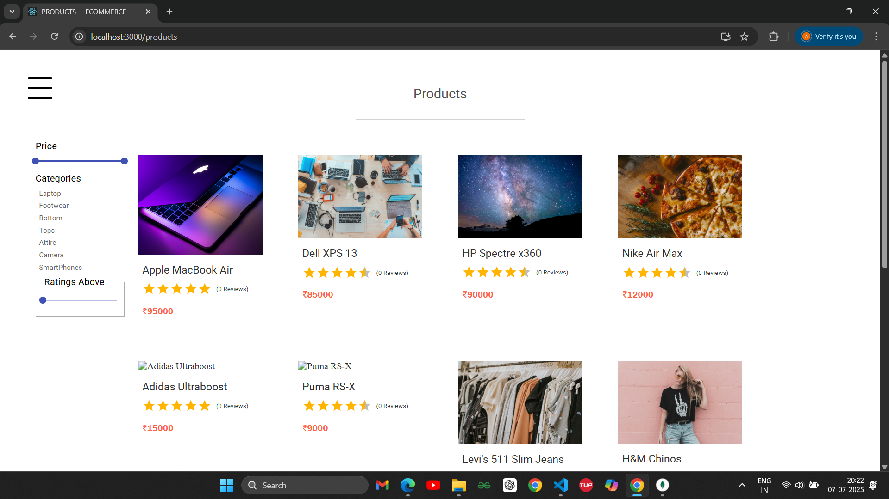
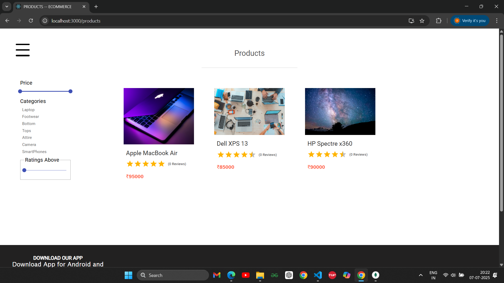
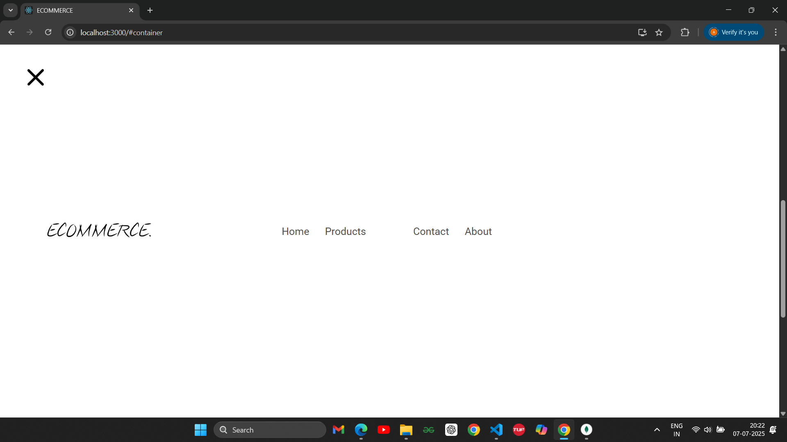
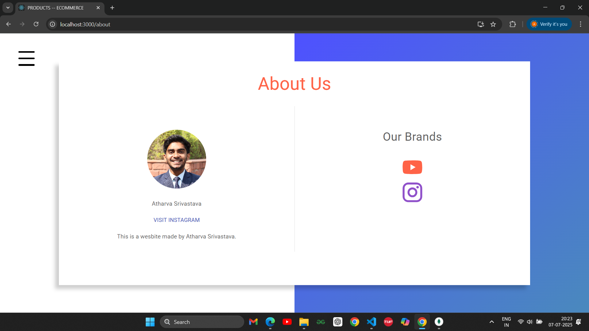
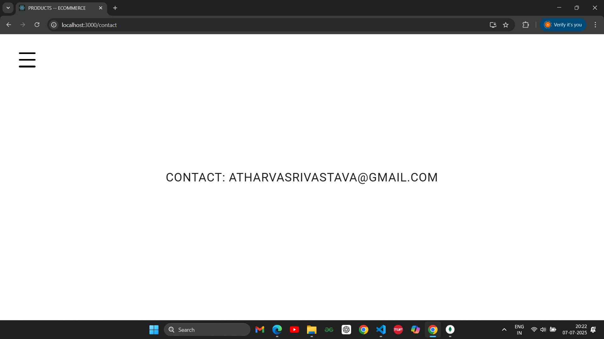
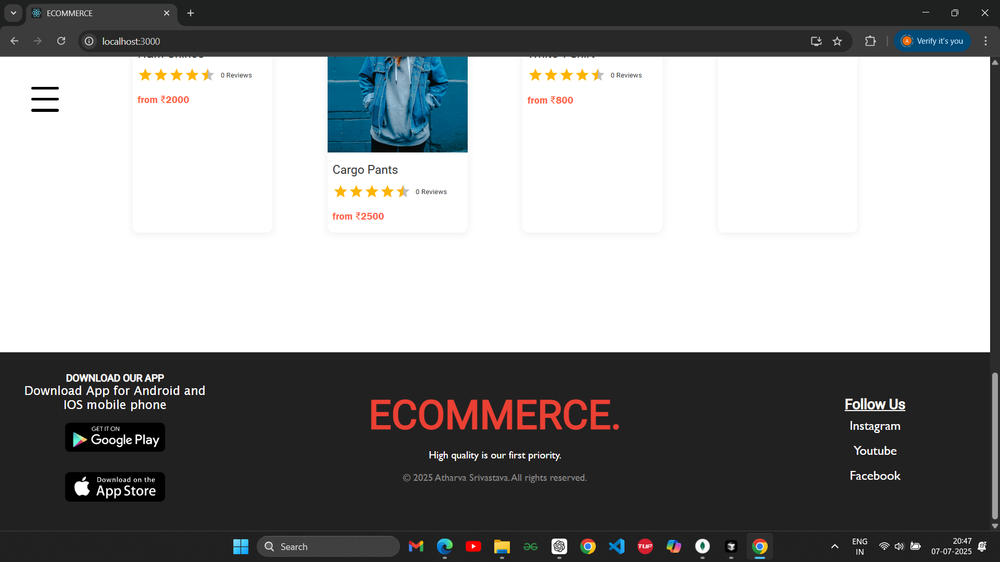

# 🛒 ECOMMERCE - MERN STACK PROJECT

Welcome to **Ecommerce**, a full-fledged MERN stack project designed for showcasing a seamless online shopping experience. This project comes with a beautifully designed frontend, powerful backend, dynamic product filtering, responsive routing, and essential user interaction pages like **Contact** and **About Us**.

---

## 🧰 Tech Stack

**Frontend**

* React.js
* React Router DOM
* Axios
* CSS3 / Tailwind (optional)

**Backend**

* Node.js
* Express.js
* MongoDB
* Mongoose

**Tools**

* Postman (API Testing)
* VS Code
* Git & GitHub

---

## 🌐 Features

### 🏠 Home Page

* Stunning landing page with an animated scroll experience.
* Call-to-action directing to product listings.



---

### 🌟 Featured Products

* Grid view of curated featured items.
* Quick access to trending and hot products.



---

### 🔍 Full Product Listing + Filters

* View all available products dynamically.
* Filter products based on:

  * **Price Range** (via Slider)
  * **Rating Threshold** (via Slider)
  * **Category Selection**





---

### 🧭 Routing and Tab Switching

* Smooth navigation between pages using React Router DOM.
* Includes routes:

  * `/` → Home
  * `/products` → Product Listing
  * `/about` → About Us
  * `/contact` → Contact



---

### 📇 About Us Page

* Displays developer’s profile with social media link.
* Highlights branding using logos like YouTube and Instagram.



---

### ✉️ Contact Page

* Simple yet effective display of contact email for user queries.



---

### 📥 Footer Section

* Contains mobile app download CTA.
* Responsive and fixed at the bottom of long pages.
* Provides quick access to the brand identity.



---

## 📡 API Functionalities

* **GET `/api/products`** – Fetch all products
* **GET `/api/products/:id`** – Fetch single product by ID
* **POST `/api/products`** – Create new product (admin only)
* **PUT `/api/products/:id`** – Update a product (admin only)
* **DELETE `/api/products/:id`** – Delete a product (admin only)
* **GET `/api/products?category=laptop&price[lte]=50000&ratings[gte]=4`** – Filter products based on query

---

## 📂 Folder Structure Overview

```
/client
   └── src
       ├── components
       ├── pages
       ├── App.js
       └── index.js

/server
   ├── controllers
   ├── models
   ├── routes
   ├── config
   └── server.js
```

---

## 👤 Developer

**Atharva Srivastava**
📧 [atharvasrivastava@gmail.com](mailto:atharvasrivastava@gmail.com)

---
